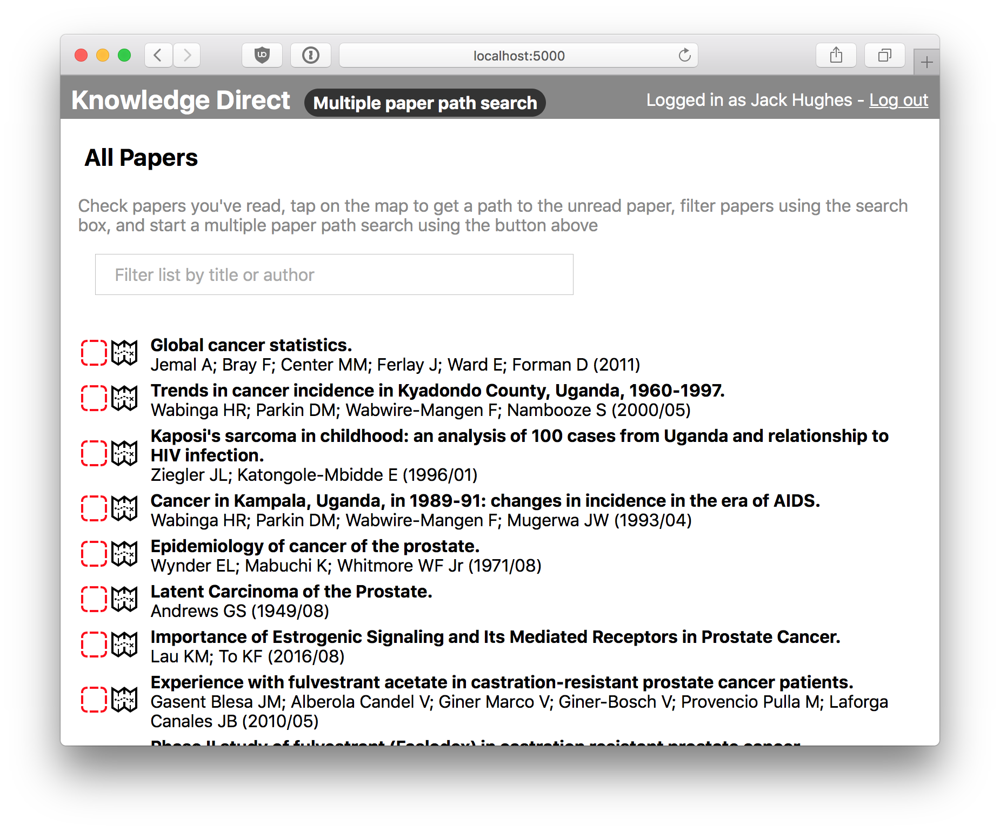
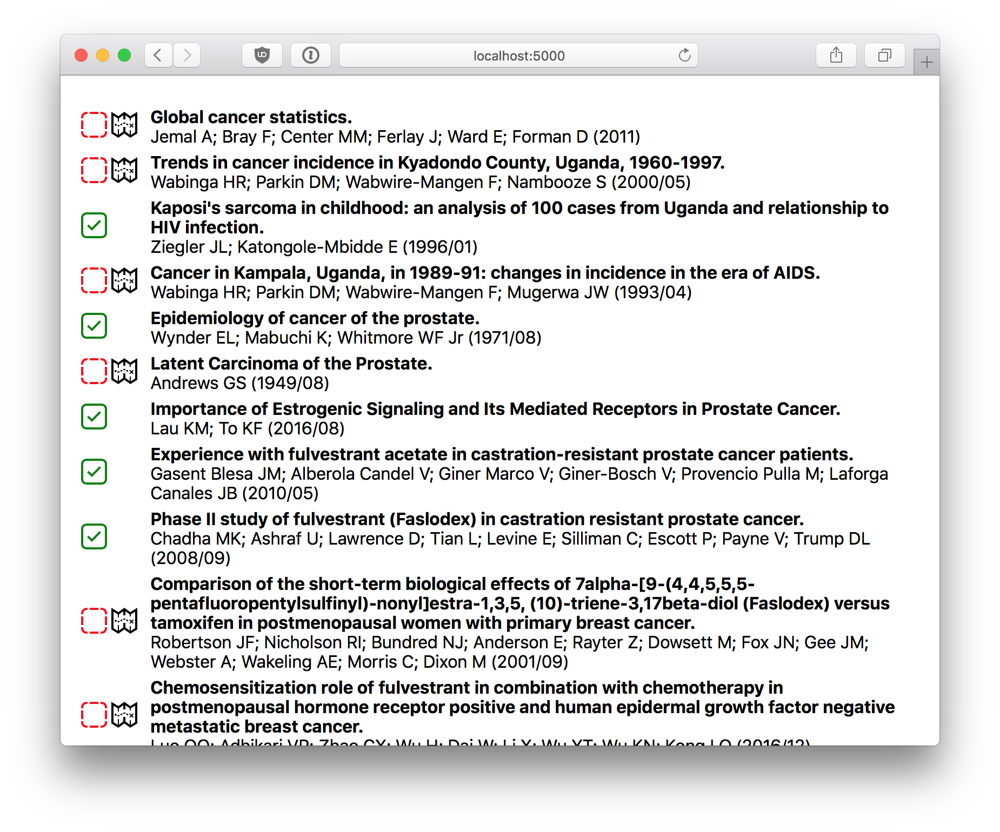
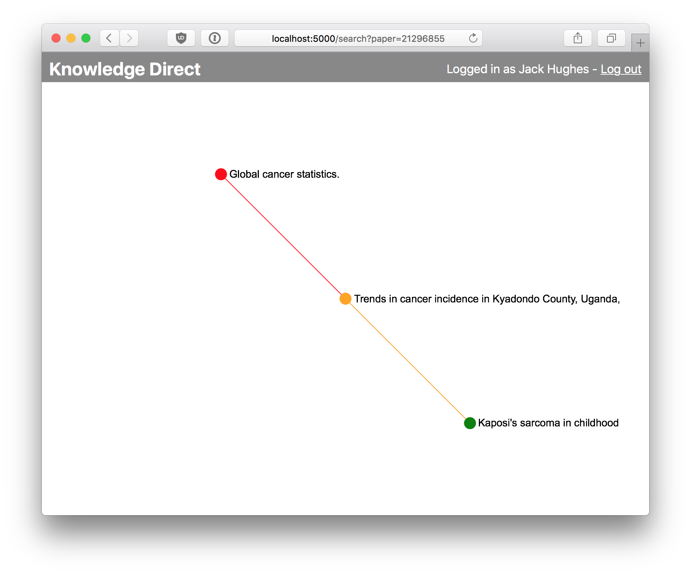

# Knowledge Direct :books:
A web app to find literature to get you from what you know to what you want to know as efficiently as possible. Become familiar with a new field, understand a collaborators publication or check key publications for your literature review - all quickly and efficiently.

## Introduction
Think of all possible knowledge as a (very) high dimensional hyperspace. Any publication will occupy some subspace of this hyperspace.
Conventional literature searches provide the publications that intersect some subspace, usually defined by a keywords.
More recent social media/bot approaches try to interpret the subspace the user is familiar with and suggest publications that exist at or just outside the boundary of this familiarity.
Our service provides a means of bridging between the subspace of knowledge which the user knows and their search subspace. This is done by presenting the minimum necessary publications required for the user to traverse between these subsapces.

## Implementation

Publication subspace coverage is approximated as nodes and the hyperspace is projected onto a network with distances between nodes as approximations to the distances within the hyperspace.

These distance estimates are an aggregations of several factors including whether the papers are citation/reference connected (first degree connection), how many shared cited/referencing papers they have (second degree connections) and overlap of keywords.
More could include text analysis of abstract/full text analysis; author input; experint input; user input or others.

A shortest path is found on a network of unity weight edges for distances below a threshold and weights penalised above unity for distances above the threshold. This threshold is to model the users ability to move outside his field of knowledge and the weight of unity for comprehensible papers aims to minimize to number of new papers to read. So papers they find comfortable learning are included but papers that they would find challeneging are penalised.

Users can choose to explore a single paper or a set of papers. In the former case, papers in the shortest path are suggested. In the latter, the minimal number of papers are suggested such that the resulting graph consisting of the known papers, suggested papers and desired papers to explore is connected.

## Getting Started

Set configuration and set root directory address
```bash
cp back_end/config_default.py back_end/config.py
open config.py
```

Install dependencies (note: Python 3 and pip3 is required):
```bash
pip3 install -r requirements.txt
```

Start the server:
```bash
python3 back_end/server.py
```

## Lessons Learned
* Networkx is great and easy to use
* Don't be the guy not doing anything at the end who gets stuck with documentation.

## Suggested Things and Future Ideas
* knowescape.org
* Neo4j
* dependence tree (rather than network)
* Yewno
* OpenCitatioCorpus

## Screenshots




